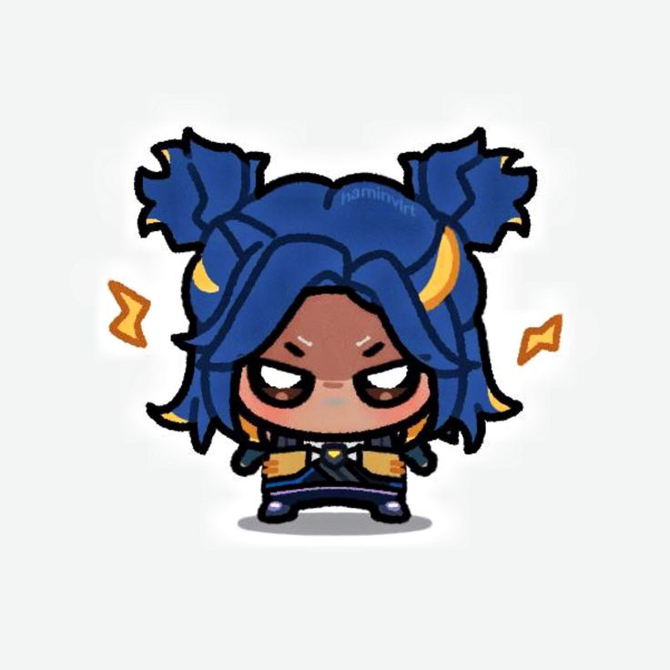

# Hi, I'm Bara 👋

I'm a **PHP & Laravel developer** who loves building clean, well-structured web apps. On the side, I'm learning game development with **Godot Engine** — still very much a beginner, but enjoying every step of it.

---

## 🧰 Tech Stack

**Languages**
- PHP · GDScript · JavaScript · HTML · CSS

**Frameworks & Libraries**
- Laravel · Tailwind CSS · Bootstrap

**Tools**
- VS Code · npm · Godot Engine

---

## 📌 Pinned Projects

### [my-laravel-app](https://github.com/bara/my-laravel-app)
> Web application built with Laravel and Tailwind CSS.  
> `PHP` `Laravel` `TailwindCSS` `MySQL`

### [godot-platformer](https://github.com/bara/godot-platformer)
> My first 2D game project in Godot. Still a work in progress.  
> `Godot` `GDScript`

---

## 📊 MY AGENT FAVORITE

---

## 📫 Contact

- Instagram: [@mr.bara023](https://www.instagram.com/mr.bara023/)

---

*Open to collaboration and freelance projects.*
